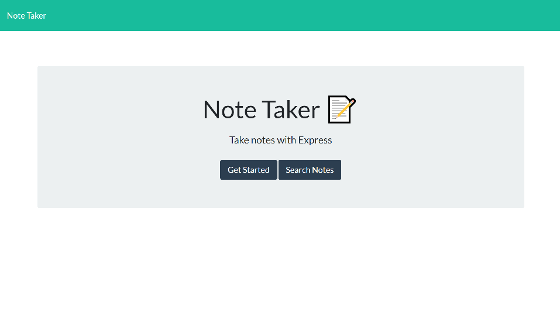
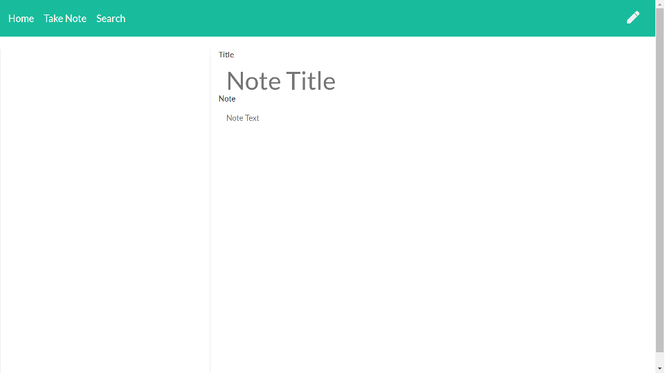
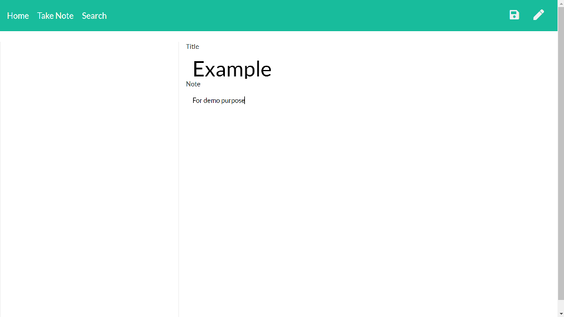
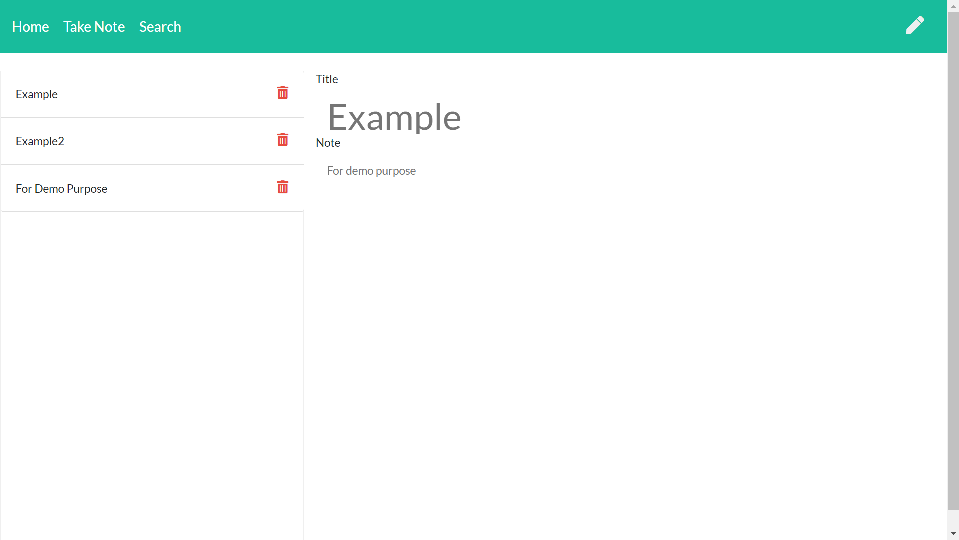
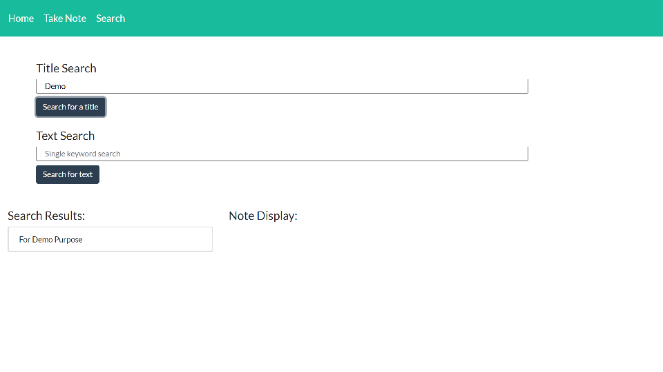
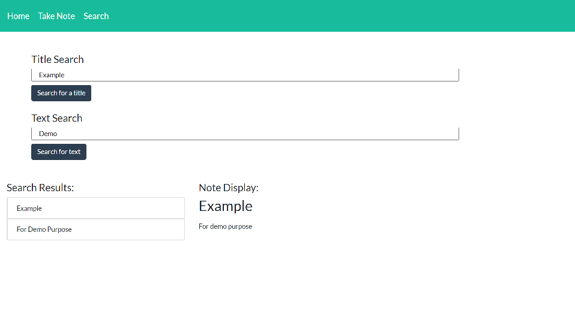
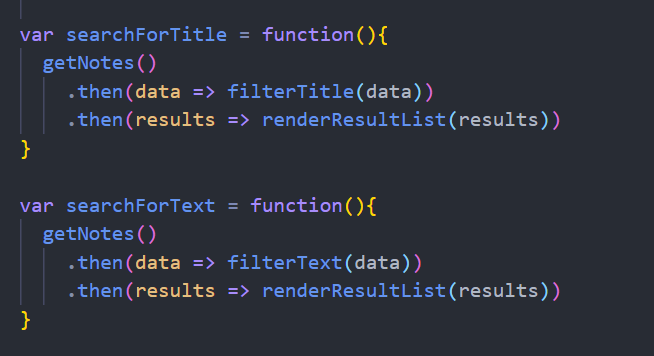
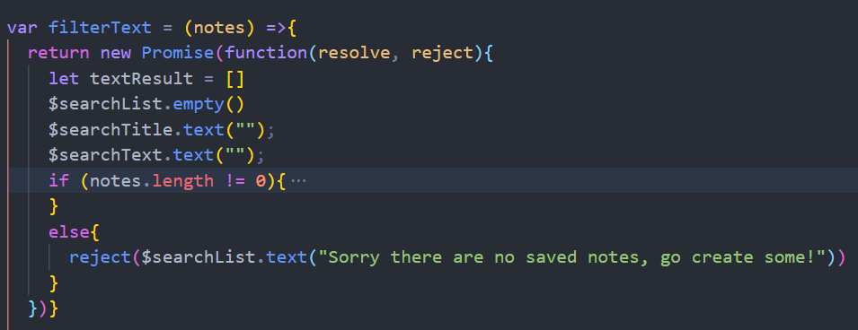

# Note Taker
 

## Description
It is a fully functional note taker that has information saved server side
## Table of content
[#Installation](#Installation) 
[#Usage](#Usage) 
[#Technology Used](#Technology) 
[#Credits](#Credits) 
[#License](#License) 
[#Contacts](#Contacts)
## #Installation
When you first clone the repo run "npm i" in terminal to download dependency. Once it's done run "node server" in terminal and go to "http://localhost:8080/" in your browser.
## #Usage
This program can quickly save, and delete any notes you might have. On the search page you can search by title or a single keyword. 

When you first load into the program through my heroku deployment or through cloning the repo you should see:

We will start off by hitting get started on the page and it will bring you to the page to take you very first note:

After filling in the text fields, a save icon will appear in the top right:

I typed out a few notes for this example and as you create notes, a new tab will be created on the left side. When you hit on the note it will bring the note back to the text field, also note that any notes that are created can be deleted by hitting the trash can symbol.

In the top navbar you can navigate to the search page where we can start searching for any saved notes by title or a keyword:

 

This is my first time using a promise chain to solve my async issue with using express to fetch data.

## #Technology

javascript 
bootstrap 
jQuery 
express 
Node.js 

## #Credits

## #License

## #Contacts
If you have any further questions or comments, please dont hesitate to contact me at: <kinwai.lam730@gmail.com>
  
 